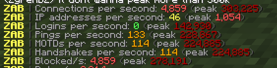

# ZAB (Zyre Anti Bot)

A fast, lightweight antibot and live traffic monitor for BungeeCord, Waterfall, Paper, and Spigot.

<p align="center">
  
</p>

Most antibot plugins let thousands of bots connect and spam packets before doing anything, which eats up your CPU and crashes your server. ZAB blocks bad connections right at the door before your server wastes time processing them.

Works on Minecraft 1.8 through 1.21+ (Java 8 to 21+).

## Quick Setup

1. Grab the latest jar from [Releases](https://github.com/zyrexdz/Zyre-Anti-Bot/releases/latest):
   * **BungeeCord / Waterfall**: `ZAB-Bungee-1.0.0.jar`
   * **Paper / Spigot**: `ZAB-Bukkit-1.0.0.jar`
2. Drop the jar into your `plugins` folder and restart your server.
3. Type `/zab verbose top` (BossBar) or `/zab verbose down` (Action Bar) in-game to see live traffic right on your screen.

## Commands

All commands need the `zab.admin` permission (OPs have it by default).

* `/zab verbose [top|down]`: Toggle the on-screen live traffic bar (BossBar at the top, or Action Bar above your hotbar).
* `/zab blacklist <on|off|barely|peak>`: Change how ZAB handles blocked connections:
  * `on`: Normal mode. Drops blocked IPs immediately for maximum performance.
  * `peak`: High-speed mode. Catches quick traffic spikes instantly so you see real peaks even if an attack freezes the server.
  * `barely`: Probes incoming packets so you can still see handshakes, logins, and pings from blocked bots.
  * `off`: Turns off blocking and only monitors traffic.
* `/zab peak [on|off]`: Quickly turn peak mode on or off.
* `/zab barely [on|off]`: Quickly turn packet probing on or off.
* `/zab antiafk [on|off|status] [version]`: Keeps your server awake with a tiny built-in helper bot (`ZABAFK`).
* `/zab stats`: Shows current traffic rates and peak records in chat.
* `/zab reset`: Clears peak records.
* `/zab unblock <ip>`: Unblock an IP address.

## Configuration

Found in `plugins/ZAB/config.yml`:

```yaml
# Blacklist mode on startup: on, peak, barely, or off
blacklist-mode: "on"

# How many connections a single IP can make per second before getting blocked
max-connections-per-ip: 6

# How long a blocked IP stays blacklisted (in minutes)
block-minutes: 5

# How many connections per second trigger attack mode
attack-cps: 40
attack-end-seconds: 10

# Ask new players to reconnect once during an attack to verify they are real
attack-verify: true

# Lowest peak number to announce in chat
min-peak: 3

# IPs that can never be blocked (add your proxy IP here if running on Spigot)
trusted-ips:
  - 127.0.0.1

# Anti-AFK bot settings
antiafk-port: 0
antiafk-version: "auto"
antiafk-password: "" # AuthMe password if your server uses one
```

## How It Works

* **Instant Drops**: Blocked IPs are cut off immediately at the network socket layer. The server doesn't allocate memory or decode Minecraft packets for them.
* **100% Accurate Counting**: Counts real discrete packets every 50ms without multiplying or guessing numbers. If 40 bots connect, you see 40.
* **Reconnection Check**: When an attack starts, first-time visitors get asked to reconnect once. Real players get right in and get remembered in `verified.txt`, while simple bot floods get dropped.
* **Anti-AFK**: If your host sleeps or shuts down empty servers, `/zab antiafk on` keeps a lightweight local bot connected to keep the server running.

## Compiling

Needs Java 8+ and Maven.

```bash
# Windows
build.bat

# Linux / macOS
mvn clean package
```

Built jars will be in `bungee/target/` and `bukkit/target/`.

## License

[MIT](LICENSE)
